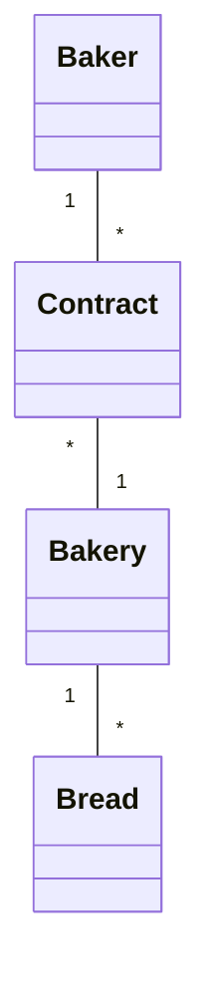

# Project .NET Framework

* Naam: Rafaël Tobias
* Academic year: 23-24
* Subject: Bakker \*-* Bakkerij 1-* Brood

## Sprint 3

### Both search criteria completed
```sql
SELECT "b"."Id", "b"."DateOfBirth", "b"."Name"
      FROM "Bakers" AS "b"
      WHERE (@__partOfName_0 = '' OR instr("b"."Name", @__partOfName_0) > 0) AND "b"."DateOfBirth" = @__chosenBirth_1
```

### Search by name only
```sql
SELECT "b"."Id", "b"."DateOfBirth", "b"."Name"
      FROM "Bakers" AS "b"
      WHERE @__partOfName_0 = '' OR instr("b"."Name", @__partOfName_0) > 0
```

### Search by date of birth only
```sql
SELECT "b"."Id", "b"."DateOfBirth", "b"."Name"
      FROM "Bakers" AS "b"
      WHERE "b"."DateOfBirth" = @__chosenBirth_0
```

### Both search criteria empty
```sql
SELECT "b"."Id", "b"."DateOfBirth", "b"."Name"
FROM "Bakers" AS "b"
```

## Sprint 4



## Sprint 6

### New publisher

#### Request

```http request
POST https://localhost:7182/api/Breads
Content-Type: application/json

{"Id": 11, "name": "bread", "price": 135, "weight": 100, "dateOfProduction":  "2023-12-29"}
```

#### Response

```http request
HTTP/1.1 201 Created
Content-Type: application/json; charset=utf-8
Date: Fri, 29 Dec 2023 13:26:11 GMT
Server: Kestrel
Location: https://localhost:7182/api/Breads/11
Transfer-Encoding: chunked

{
  "id": 11,
  "name": "bread",
  "price": 135,
  "weight": 100,
  "dateOfProduction": "2023-12-29T00:00:00"
}
```

## Sprint 7
### Users
#### Admins
- admin@app.com
- rafael@app.com

#### Normal Users
- user@app.com
- second.user@app.com

#### Password for all
- Password1!

### HTTP
#### Unauthorized user
```
POST https://localhost:7182/api/Bakeries/add
Content-Type: application/json

{"Name": "UnauthorizedHttpTest", "Adres": "1 UHttpTest"}
```
#### Authorized user
```
POST https://localhost:7182/api/Bakeries/add
Content-Type: application/json
Cookie: .AspNetCore.Identity.Application=CfDJ8D24Ib4suk9JghDEUrOOISgpeU1z2_7ybiFHYNF-uBZTWHKl0lYpCwOclM53rmO57VyaCH8lvA7cwx6n8rn0-pTFoJStyNAjWYHb2e8zG4aNjYSXMY8d-z9jTtG9g94e-EILpfbJG26AOGhL8yPdvWVgi2NQ95RbSqW4AiHpB-AoDpsvF7ZS6iW2r-birSzMZxSlKbKbZL7ludebQ4JLYESJ-oSQb3kFQ2nPQJJkzthrKDCyKkMuaaiaxcE1m9JZhl8QXXG_CYBl9_2fdCJCh7lBnp7YhA84DGM3fh2h_wM7Fly2A7tA3TvSJATbW-f3I0mzH45Tnmsjq--lyYlFrl-I2bf1w2JOQdm6Gs_Xg-FfBaEi8LLtqbATgjKzl3gCyf33yiVX-sK6fjW-9jWUa7dpDjKZOINpywoXeHVZ9LnGo46DYpa6sylU5BWC4vJUrzu9utdsag90918ZYx8mG0DDuc6f7gXOxIY-z6KvWGo27KY6LFqUr3LwJ_q5v-EySiGpiiycsp2HozQpsI8TBWqjclb8PezSs72fQxCg7tvsQ6CgvEaJS8aKCHY1N7U89qtoHqlje-1HReItYkhgqHhA6MuRNryAt54VOXTlBsWz307ZK9qReCMoQlV5dxvdCedxouNRaNpRX7GOU7XkXjQLPNI4GhcjU1anZiLgCTA5WzUwjQopFyDM5kn9kNkq1TVU-3ry0Ap_JMSA0y7ypet7lxWnPwEnP0fwwz7Z_9ZCsSHeWRHN7a2dms8mMC35ft9N48_A2OR2FooDi5Kx8XiaUiMcIKZoqjP1CGtp-xq6dSJPU45sCPWikFu3MKhsIMkwcrq7FXA6KrURjBYMvdE

{"Name": "AuthorizedHttpTest", "Adres": "2 AHttpTest"}
```